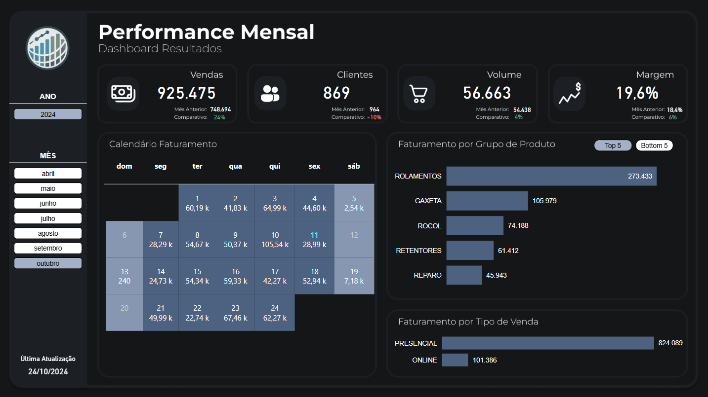

# 📊 Projeto Power BI – Vendas Empresa de Rolamentos

Este projeto apresenta uma análise interativa das **vendas de rolamentos**, desenvolvida em Power BI. Ele permite visualizar e explorar os principais indicadores de desempenho comercial, com foco em faturamento, clientes, produtos e tendências.

---

## 📁 Estrutura do Projeto

- `powerbi/ProjetoRolamentos.pbix` → Relatório Power BI com as análises
- `powerbi/dashboard.png` → Imagem do dashboard principal
- `data/vendas.xlsx` → Arquivo com os dados utilizados no relatório

---

## 📷 Dashboard

---

## 📌 Destaques da Análise

- Visão mensal da performance de vendas, clientes, volume e margem  
- Calendário de faturamento com detalhamento por dia da semana  
- Filtros interativos por ano e mês  
- Faturamento segmentado por grupo de produto (Top 5 e Bottom 5)  
- Comparativos com mês anterior e variações percentuais  
- Análise por tipo de venda (Presencial vs Online)

---

## 💾 Fonte de Dados

Os dados utilizados foram **modificados e disponibilizados** neste repositório, dentro da pasta [`data/`](data/), para fins didáticos e de portfólio.

